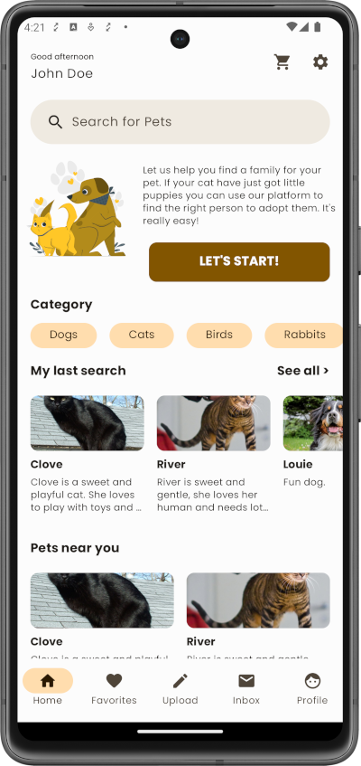

<!--
  Title: MindSync
  Description: The first Open Source Template with all boilerplate code needed to quickly create Kotlin Multiplatform Applications.
  Author: MindSync, Inc
  -->
 **ROADMAP**: Checkout the board with the progress done for the template [here](https://github.com/orgs/dallay/projects/1).
   

* <i>The Multiplatform Kickstarter Basic Template</i> *

The first Open Source Template with all boilerplate code needed to quickly create Kotlin Multiplatform Applications.

  

<b><a href="#about">About</a></b>
|
<b><a href="#download">Download</a></b>
|
<b><a href="#usage">Usage</a></b>
|
<b><a href="#pro-template">PRO Template</a></b>
|
<b><a href="#who-made-this">Who Made This</a></b>
|
<b><a href="#contribute">Contribute</a></b>
|
<b><a href="#bugs-and-feedback">Bugs and Feedback</a></b>
|
<b><a href="#socila-media">Social Media</a></b>
|
<b><a href="#license">License</a></b>

 

### About

Multiplatform Kickstarter is an opinionated template based in **Kotlin Multiplatform** (KMP) and **Compose Multiplatform**. While most templates only solves the basic functionality, we are aiming to solve most of the common problems when creating applications from initial status to production. 

Comes with this stack built-in:

- **Shared UI and Logic for all platforms**
- **Kotlin**
- **Compose Multiplatform**
- **Kotlin Coroutines**
- **Kotlin Serialization**
- **Kotlin Datetime**
- **Voyager** for Navigation and View Models
- **Koin** as Dependency Injection
- **Detekt** for static code analysis
- **Ktlint** linter
- **Ktor** for Client
- **Multiplatform-settings** for storage
- **Kamel** for Images
- **Kermit** for logging
- **Version Catalogs**
- **Ktor for Server** (PostgresSQL+Tomcat)
- **Swagger Codegen** for **OpenAPI**

#### Components and Screens

* Login/Sign Up
* Basic listing
* Basic insertion form
* Basic Detail
* Basic Debug Mode
* Basic Profile
* Basic CI
* Basic Composable Components
* Dark mode ready
* Navigation
* Accessibility (and color accessible themes)
* Tracking system
* Internationalization (FIGS)
  

### Download
TODO: Add download links
  

### Usage

Go to the [Documentation page](https://docs.multiplatformkickstarter.com) for all the information. (**WIP**)
  

Bugs and Feedback
-----------------

For bugs, questions and discussions please use the [Github Issues](https://github.com/dallay/mindsync/issues).
  
